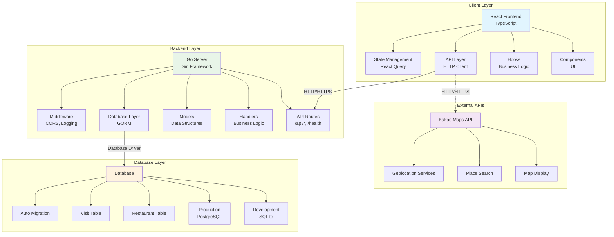
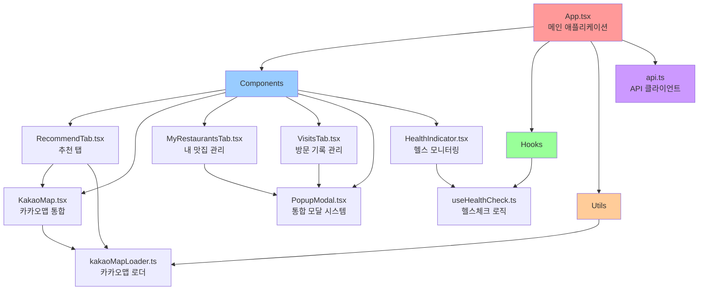
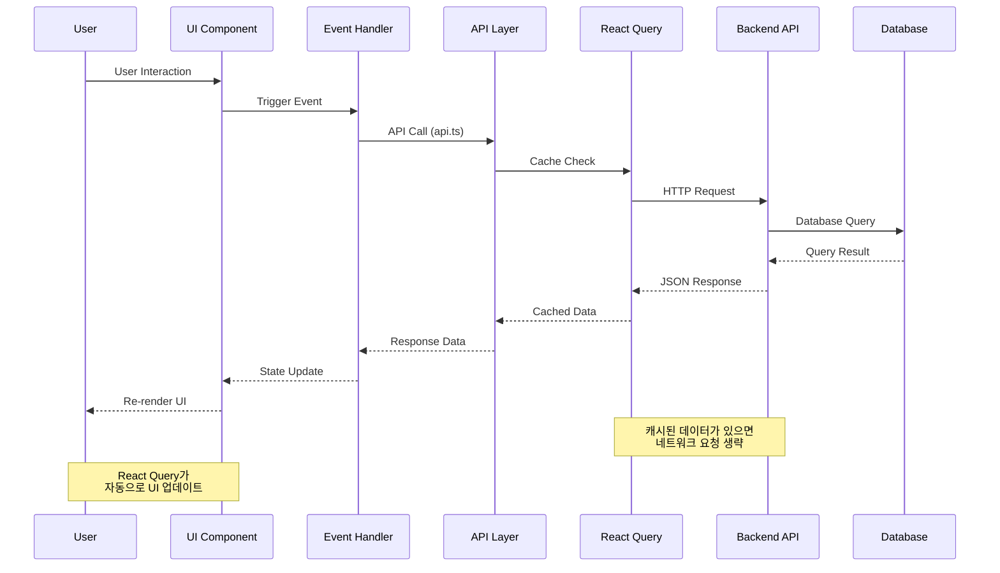
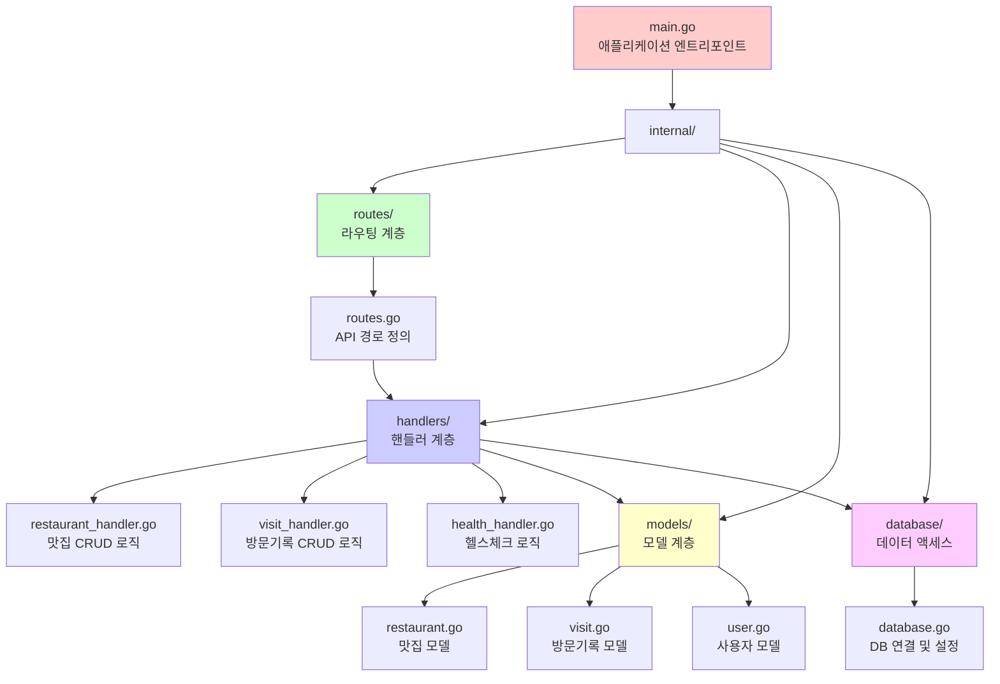
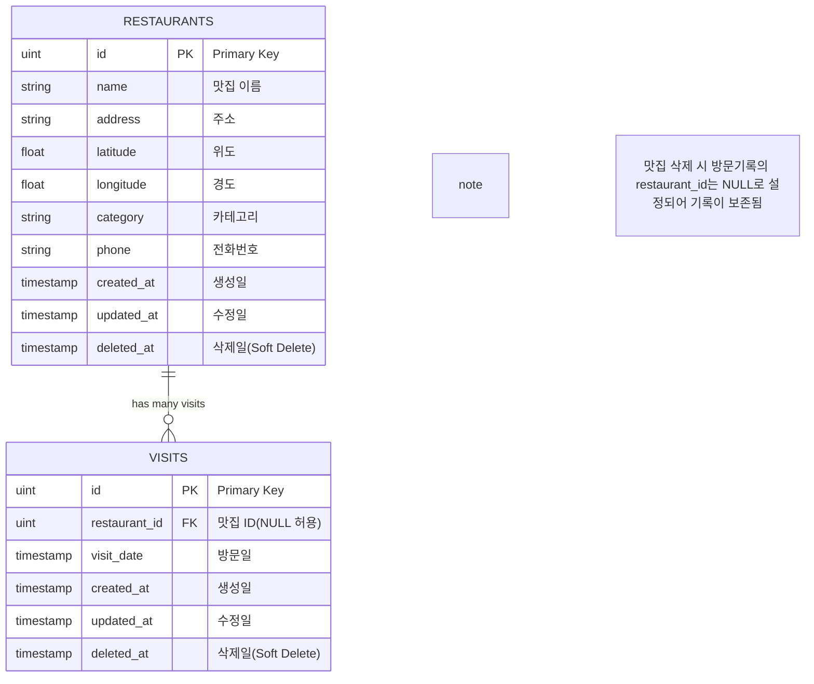
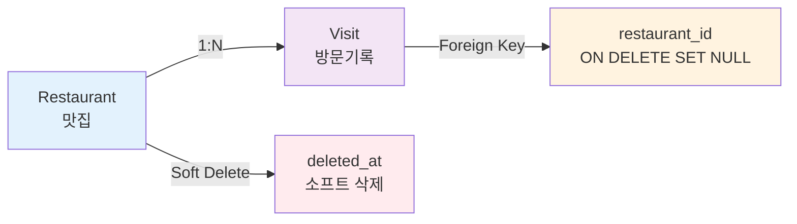
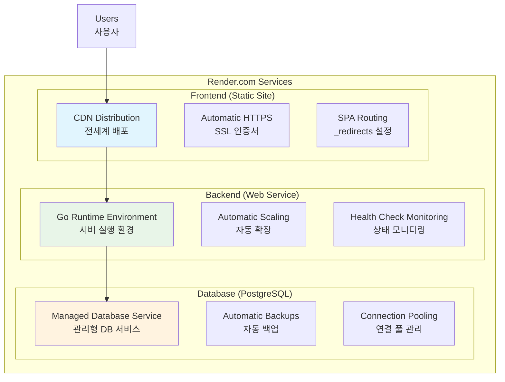
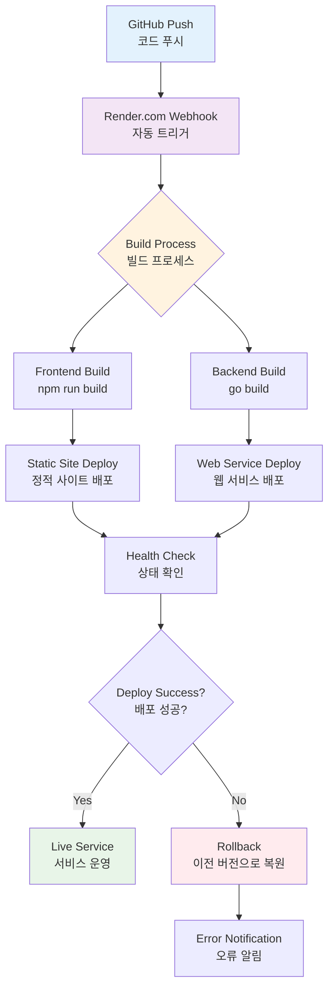
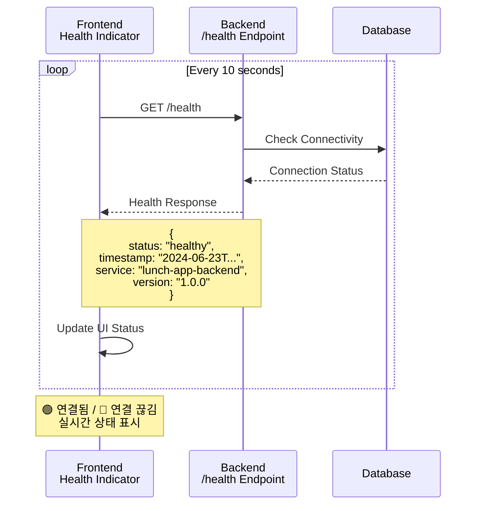

# Lunch App 아키텍처 문서

## 전체 시스템 아키텍처



## 프론트엔드 아키텍처

### Component Architecture



### State Management Architecture
```
┌─────────────────────────────────────────────────────────────────┐
│                    State Management                            │
├─────────────────────────────────────────────────────────────────┤
│  React Query (Server State)                                    │
│  ├── Restaurant Cache                                          │
│  ├── Visit Cache                                               │
│  ├── Auto Refetch                                              │
│  └── Error Handling                                            │
│                                                                 │
│  Local State (useState)                                        │
│  ├── UI State (modals, forms)                                  │
│  ├── Map State (position, markers)                             │
│  └── Component State                                           │
└─────────────────────────────────────────────────────────────────┘
```

### Data Flow



## 백엔드 아키텍처

### Layered Architecture



### Request Flow
```
HTTP Request
        │
        ▼
Gin Router
        │
        ▼
CORS Middleware
        │
        ▼
Route Handler
        │
        ▼
Business Logic
        │
        ▼
GORM (ORM)
        │
        ▼
Database
        │
        ▼
Response JSON
```

## 데이터베이스 아키텍처

### Database Schema
```sql
-- Restaurant Table
CREATE TABLE restaurants (
    id SERIAL PRIMARY KEY,
    name VARCHAR(255) NOT NULL,
    address VARCHAR(500) NOT NULL,
    latitude FLOAT NOT NULL,
    longitude FLOAT NOT NULL,
    category VARCHAR(100),
    phone VARCHAR(50),
    created_at TIMESTAMP DEFAULT NOW(),
    updated_at TIMESTAMP DEFAULT NOW(),
    deleted_at TIMESTAMP NULL
);

-- Visit Table
CREATE TABLE visits (
    id SERIAL PRIMARY KEY,
    restaurant_id INTEGER REFERENCES restaurants(id) ON DELETE SET NULL,
    visit_date TIMESTAMP NOT NULL,
    created_at TIMESTAMP DEFAULT NOW(),
    updated_at TIMESTAMP DEFAULT NOW(),
    deleted_at TIMESTAMP NULL
);

-- Indexes for Performance
CREATE INDEX idx_restaurants_deleted_at ON restaurants(deleted_at);
CREATE INDEX idx_visits_deleted_at ON visits(deleted_at);
CREATE INDEX idx_visits_restaurant_id ON visits(restaurant_id);
CREATE INDEX idx_visits_visit_date ON visits(visit_date DESC);
```

### Database ER Diagram



### Data Relationships



## API 아키텍처

### RESTful API Design
```
Health Check:
GET    /health                 # 서버 상태 확인

Restaurants:
GET    /api/restaurants/       # 목록 조회
POST   /api/restaurants/       # 신규 생성
GET    /api/restaurants/{id}   # 상세 조회
DELETE /api/restaurants/{id}   # 삭제 (Soft Delete)

Visits:
GET    /api/visits/            # 목록 조회
POST   /api/visits/            # 신규 생성
DELETE /api/visits/{id}        # 삭제
```

### API Response Format
```json
{
  "status": "success|error",
  "data": { ... },
  "message": "descriptive message",
  "timestamp": "2024-06-23T10:30:00Z"
}
```

## 보안 아키텍처

### CORS Configuration
```go
cors.New(cors.Config{
    AllowOrigins:     []string{
        "https://lunch-app-spd2.onrender.com",
        "http://localhost:3000"
    },
    AllowMethods:     []string{"GET", "POST", "PUT", "DELETE", "OPTIONS"},
    AllowHeaders:     []string{"Origin", "Content-Type", "Accept", "Authorization"},
    ExposeHeaders:    []string{"Content-Length"},
    AllowCredentials: true,
    MaxAge:          12 * time.Hour,
})
```

### Environment Variables
```
Frontend:
- REACT_APP_KAKAO_MAP_APP_KEY  # 카카오맵 API 키
- REACT_APP_API_BASE_URL       # 백엔드 서버 URL

Backend:
- PORT                         # 서버 포트
- GIN_MODE                     # release/debug
- DATABASE_URL                 # PostgreSQL 연결 문자열
```

## 배포 아키텍처

### Render.com Infrastructure



### CI/CD Pipeline



## 모니터링 아키텍처

### Health Check System



### Error Handling Strategy
```
Frontend Error Boundary
        │
        ├── Component Errors
        ├── API Errors
        └── Network Errors
        │
        ▼
PopupModal System
        │
        ├── User-friendly Messages
        ├── Retry Mechanisms
        └── Fallback UI
```

## 성능 최적화 아키텍처

### Frontend Optimizations
- **React Query**: 서버 상태 캐싱 및 자동 갱신
- **Code Splitting**: 컴포넌트별 지연 로딩
- **Image Optimization**: 카카오맵 마커 최적화
- **Bundle Optimization**: Tree shaking 및 압축

### Backend Optimizations
- **Database Indexing**: 자주 쿼리되는 컬럼 인덱싱
- **Connection Pooling**: GORM 연결 풀 관리
- **GZIP Compression**: HTTP 응답 압축
- **Query Optimization**: N+1 문제 방지 (Preload 사용)

## 확장성 고려사항

### Horizontal Scaling
- **Stateless Backend**: 세션 상태 없는 RESTful API
- **Database Scaling**: PostgreSQL 읽기 복제본 추가 가능
- **CDN Integration**: 정적 자산 글로벌 배포

### Feature Extensibility
- **Plugin Architecture**: 새로운 맛집 카테고리 추가 용이
- **API Versioning**: 하위 호환성 유지
- **Microservice Migration**: 필요시 서비스 분리 가능

이 아키텍처는 현재 구현된 Lunch App의 전체적인 구조와 설계 원칙을 설명하며, 향후 확장과 유지보수를 위한 기반을 제공합니다.